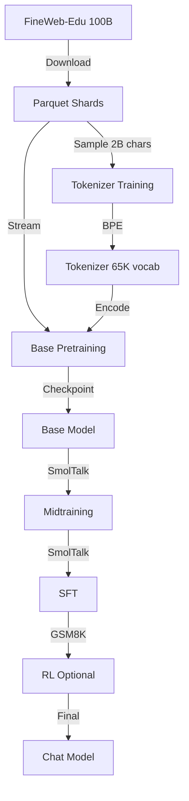

# Tokenizer Integration and Training Data

## Tokenizer Architecture Integration

### Current Tokenizer: RustBPE + Tiktoken

**Implementation**: [`tokenizer.py`](file:///Users/ibraniang/Desktop/nanogpu/kpt_nanochat/nanochat/nanochat/tokenizer.py)

The nanochat tokenizer is **architecture-agnostic** and works seamlessly with both the original and Qwen2.5 architectures:

#### Key Features:
1. **BPE (Byte Pair Encoding)** - GPT-4 style tokenization
2. **Vocab Size**: 65,536 tokens (2^16) by default
3. **Special Tokens**: 9 tokens for conversation formatting
   - `<|bos|>` - Beginning of sequence
   - `<|user_start|>`, `<|user_end|>` - User messages
   - `<|assistant_start|>`, `<|assistant_end|>` - Assistant messages
   - `<|python_start|>`, `<|python_end|>` - Python tool calls
   - `<|output_start|>`, `<|output_end|>` - Python outputs

#### Training Process:
```bash
# Train tokenizer on ~2B characters of FineWeb-Edu
python -m scripts.tok_train --max_chars=2000000000
```

**Output**: Saved to `~/.cache/nanochat/tokenizer/`
- `tokenizer.pkl` - Tiktoken encoding object
- `token_bytes.pt` - Token byte mappings for evaluation

---

### Compatibility with Qwen2.5

**Vocab Size Mismatch**:
- **nanochat**: 65,536 tokens (2^16)
- **Qwen2.5-Coder**: 151,646 tokens

**Current Approach**: Train custom tokenizer
- ✅ Works with any vocab size via `GPTConfig(vocab_size=...)`
- ✅ Smaller vocab = fewer parameters in embedding layers
- ✅ Optimized for budget training ($100-$1000)

**Future Option**: Use Qwen2.5 tokenizer
```python
# To use Qwen2.5's official tokenizer (151K vocab):
# 1. Download Qwen2.5-Coder tokenizer from HuggingFace
# 2. Update vocab_size in model config
# 3. Retrain embeddings
```

---

## Training Data

### Pretraining: FineWeb-Edu

**Dataset**: [FineWeb-Edu-100B](https://huggingface.co/datasets/HuggingFaceFW/fineweb-edu)
- **Source**: High-quality educational web content
- **Size**: ~100 billion tokens (~450 billion characters)
- **Format**: 1,823 parquet shards (~250M chars each)
- **Hosted**: `karpathy/fineweb-edu-100b-shuffle` on HuggingFace

#### Download:
```bash
# Download first 8 shards (~2B chars for tokenizer training)
python -m nanochat.dataset -n 8

# Download 240 shards (~60B chars for d20 model pretraining)
python -m nanochat.dataset -n 240

# Download all 1,823 shards (~450B chars)
python -m nanochat.dataset -n -1
```

**Storage**: `~/.cache/nanochat/base_data/`

#### Data Characteristics:
- **Educational content**: Filtered for high educational value
- **Quality**: Cleaned, deduplicated web text
- **Diversity**: Covers wide range of topics
- **Tokenization**: ~4.8 chars/token with nanochat tokenizer

---

### Midtraining & Finetuning

**Midtraining Dataset**: Conversation format adaptation
- Teaches model conversation special tokens
- Tool use (Python REPL)
- Multiple choice formatting

**SFT Dataset**: [SmolTalk](https://huggingface.co/datasets/HuggingFaceTB/smoltalk)
- High-quality instruction-following conversations
- Supervised finetuning for chat capabilities

**RL Dataset**: GSM8K for math reasoning
- Reinforcement learning on grade school math
- Improves reasoning capabilities

---

## Data Flow



---

## Tokenizer Training Details

### Split Pattern (GPT-4 style):
```regex
'(?i:[sdmt]|ll|ve|re)|[^\r\n\p{L}\p{N}]?+\p{L}+|\p{N}{1,2}| ?[^\s\p{L}\p{N}]++[\r\n]*|\s*[\r\n]|\s+(?!\S)|\s+
```

**Modifications from GPT-4**:
- Changed `\p{N}{1,3}` → `\p{N}{1,2}` (numbers)
- Rationale: Less wasteful for smaller vocab sizes
- Trade-off: Slightly less efficient for long numbers

### Training Configuration:
```python
vocab_size = 65536  # 2^16
special_tokens = 9  # Conversation tokens
base_tokens = 65536 - 9 = 65527  # Learned via BPE
```

---

## Architecture-Data Relationship

### Embedding Layer:
```python
# In GPT model
self.transformer.wte = nn.Embedding(config.vocab_size, config.n_embd)
self.lm_head = nn.Linear(config.n_embd, config.vocab_size, bias=False)
```

**Parameters**:
- **Original (d20)**: 65,536 × 1,280 = 83.9M params (embeddings)
- **Qwen2.5-small (d20)**: 65,536 × 1,280 = 83.9M params (same)
- **Qwen2.5-1.5B**: 151,646 × 1,536 = 233M params (if using Qwen tokenizer)

**Impact of SwiGLU**:
- Embedding size unchanged
- Only MLP intermediate size affected
- Tokenizer completely independent of activation function

---

## Data Requirements by Model Size

### Chinchilla Scaling (20:1 token:param ratio):

| Model | Params | Tokens Needed | Chars (~4.8/tok) | Shards (250M/shard) |
|-------|--------|---------------|------------------|---------------------|
| d12 (156M) | 156M | 3.1B | 15B | 60 |
| d20 (561M) | 561M | 11.2B | 54B | 216 |
| d26 (1.0B) | 1.0B | 20B | 96B | 384 |
| Qwen2.5-1.5B | 1.5B | 30B | 144B | 576 |
| Qwen2.5-7B | 7.6B | 152B | 730B | 2,920 |

**Note**: FineWeb-Edu has 1,823 shards total (~450B chars), sufficient for models up to ~2B params.

---

## Tokenization Examples

### Pretraining:
```python
# Each document starts with BOS
text = "The capital of France is Paris."
tokens = tokenizer.encode(text, prepend="<|bos|>")
# [<bos>, The, capital, of, France, is, Paris, .]
```

### Chat Format:
```python
conversation = {
    "messages": [
        {"role": "user", "content": "What is 2+2?"},
        {"role": "assistant", "content": "4"}
    ]
}
ids, mask = tokenizer.render_conversation(conversation)
# [<bos>, <user_start>, What, is, 2, +, 2, ?, <user_end>, 
#  <assistant_start>, 4, <assistant_end>]
# mask: [0, 0, 0, 0, 0, 0, 0, 0, 0, 0, 1, 0]
#       (only train on assistant's "4")
```

---

## Key Takeaways

1. **Tokenizer is Architecture-Agnostic**
   - Works with original nanochat and Qwen2.5
   - Only dependency: `vocab_size` parameter

2. **Training Data: FineWeb-Edu**
   - High-quality educational web content
   - 100B tokens (~450B chars)
   - Sufficient for models up to ~2B params

3. **Custom vs. Qwen Tokenizer**
   - **Custom (65K)**: Smaller, faster, budget-friendly
   - **Qwen (151K)**: Larger vocab, potentially better for code
   - Both work with Qwen2.5 architecture

4. **Data Scaling**
   - Follow Chinchilla: 20 tokens per parameter
   - d20 model needs ~11B tokens (240 shards)
   - Larger models need more data

5. **Special Tokens**
   - Enable conversation formatting
   - Support tool use (Python REPL)
   - Critical for chat capabilities
